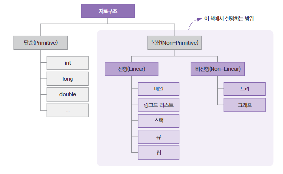

# 자료구조

> 자료구조란?

자료구조(Data Structure)는 컴퓨터가 데이터를 효율적으로 다룰 수 있게 도와주는 데이터 보관 방법과 데이터에 관한 연산의 총체를 뜻한다.

예를 들어 int도 자료구조인데 32비트 메모리 공간 안에 수를 할당하고, 첫 비트를 부호비트로 사용하는 등 `보관방법`을 정의하고 있고, 이에 대해 덧셈/뺄셈/곱셉/나눗셈 등 다양한 `연산`도 정의하고 있다.

> 자료구조의 종류

자료구조는 크게 단순 자료구조(Primitive Data Structure)와 복합 자료구조(Non-Primitive Data Structure)로 나뉜다. 

- 단순 자료구조는 `int`, `long`, `char` 등 프로그래밍 언어에서 통상적으로 제공하는 기본 데이터 형식이다.

- 복합 자료구조는 이제부터 본격적으로 다룰 `배열`, `리스트`, `스택`, `큐` , `그래프` 등이 이에 해당한다.
- 복합 자료구조는 다시 선형(Linear) 자료구조와 비선형(Non-Linear)자료구조로 나뉜다.
  - 선형 자료구조는 데이터 요소를 순차적으로 연결하는 자료구조로, 
    `배열`, `리스트`, `스택`, `큐`, `힙` 이 있다.
  - 비선형 자료구조는 데이터 요소를 비순차적으로 연결하는 자료구조로, 
    `트리`, `그래프` 가 있다.

> ADT(Abstract Data Types)

ADT(Abstract Data Types)는 자료구조를 추상적으로 정의한 모델이다. 자료구조에 대한 구체적 구현 방법은 정의하지 않고, 주요 동작에 대해서만 정의한 것이다.

자바의 인터페이스와 유사한데, 사용자에게는 데이터와 연산의 인터페이스만 제공하고 내부 구현은 숨긴다. 

예를들어, 스택 ADT는 LIFO 방식의 데이터 저장, 스택의 `push`, `pop` 등의 연산을 정의하지만 이는 추상화된 개념일뿐 실제 구현은 프로그래밍 언어마다 매우 다양하다.

> 본 글은 박상현 저자님의 '이것이 자료구조 + 알고리즘이다 with C언어' 책을 읽고 정리한 내용입니다.